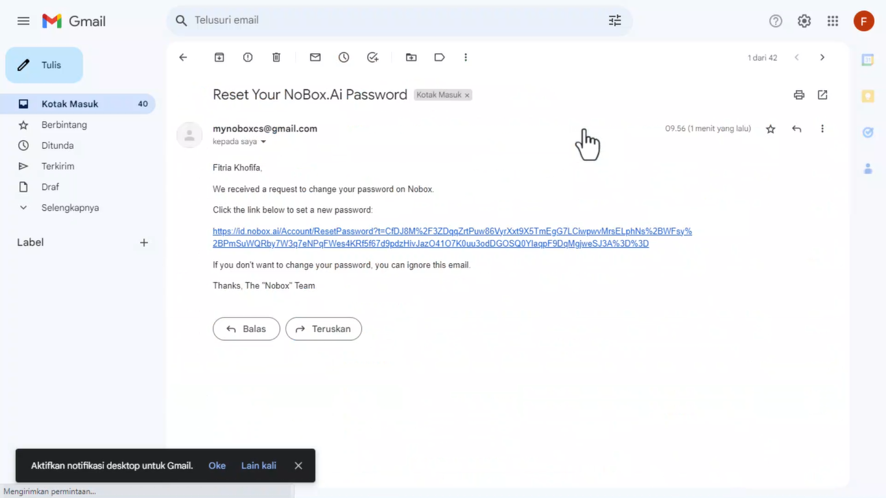

# Forgot Password

This feature can assist you if you forget your password when logging into the website id.nobox.ai. Here's how to do it:



1. Click **\[Forgot Password]** on the login page **➔** enter your email address and check the reCAPTCHA.
2. Click **\[Reset My Password]** and a password reset notification will be sent to your email.

<figure><figcaption></figcaption></figure>

3. Check your email inbox and click the link, which will direct you to the password reset page.

<figure><figcaption></figcaption></figure>

4. Enter your new password and confirm it by re-entering the password in the confirm password field.
5. Click **\[Reset My Password]** and a pop-up will appear notifying you that your password has been successfully changed.

<figure><figcaption></figcaption></figure>

6. Click **\[OK]** to go to the login page of the website id.nobox.ai
7. Please log in with your new password.

***

If you have any issues or difficulties related to Nobox.Ai, please contact us through [Support Ticket](https://crm.nobox.ai/clients/tickets)
