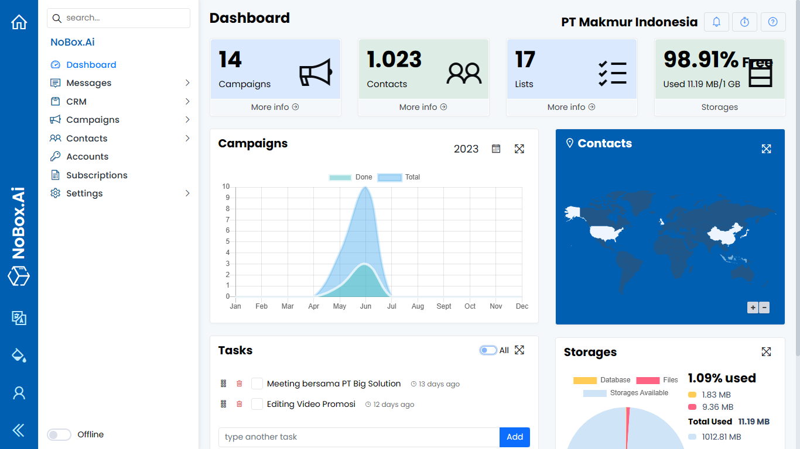

# Dashboard

Summary of activities related to Nobox.Ai that can help you make decisions.



<figure><figcaption></figcaption></figure>

On the interface, there are several sections, each with its specific function. The explanation of these functions is as follows:

<table><thead><tr><th width="161.800048828125">Features/Buttons</th><th>Function</th></tr></thead><tbody><tr><td>Campaigns</td><td>Information on total promotions and a data chart with an annual period.</td></tr><tr><td>Contacts</td><td>Information on total and display of contact data in the form of maps according to contact location.</td></tr><tr><td>Lists</td><td>Total data lists</td></tr><tr><td>Storages</td><td>Information about the percentage and details of database usage, file storage, and available space.</td></tr><tr><td>Tasks</td><td>Add tasks/notes to be completed, display all tasks, mark tasks as completed, delete tasks.</td></tr></tbody></table>

***

If you encounter any issues or difficulties related to Nobox.Ai, please contact us through [Support Ticket](https://crm.nobox.ai/clients/tickets)
