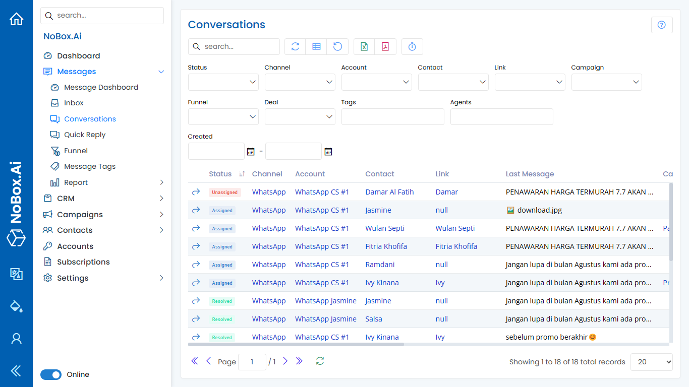

# Conversations

Conversation is one of the features on Nobox.Ai used for monitoring conversation data.



<figure><figcaption></figcaption></figure>

You can filter conversation data by Status, Channel, Account, and the provided filters. To view conversation details, click \[Open Conversation], and you will be directed to the selected conversation.

***

If you have any issues or difficulties with Nobox.Ai, please contact us through [Support Ticket](https://crm.nobox.ai/clients/tickets)
