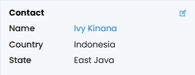
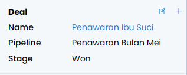

# Inbox

Inbox is one of the NoBox.Ai features used to manage all incoming messages from various channels such as WhatsApp, Telegram, Shopee, etc.



<figure><figcaption></figcaption></figure>

<table><thead><tr><th width="160.199951171875">Features/Buttons</th><th>Function</th></tr></thead><tbody><tr><td>All</td><td>All incoming conversations.</td></tr><tr><td>Unassigned</td><td>All conversations not yet assigned to an agent.</td></tr><tr><td>Assigned</td><td>Conversation assigned to the agent.</td></tr><tr><td>Resolved</td><td>Content includes a conversation that has been successfully completed/answered, and the agent wants to end the dialogue.</td></tr></tbody></table>

* The Archive Conversation feature allows users to store or sort messages that may no longer be relevant or need a response. By archiving, users can clean up their main conversation list without permanently deleting those messages. Please click the icon **\[****]** To display archived conversations.
* You can filter conversations by Status, Channel, Account, Contact, etc. To filter conversations, please click the icon. **\[****]** To display a conversation filter, click the **\[Show]** button after setting the desired data filter, and the conversation will appear according to the filter. Click **\[Reset]** to remove the conversation filter.

* The Conversation Feature allows users to start a new conversation with existing contacts in their list. This can be very useful for initiating chats with someone without having to manually search for the contact or group name. Please click the icon **\[****]** to make a new dialogue
* The Search feature is used to find conversations or contacts that match the typed keywords.

## **Incoming Message Distribution to Agents**

On the Inbox page, a supervisor can allocate customers to available agents. To add an agent, please click the **\[+ Agent]** button, and a list of available agents will appear. Click an agent's name to select that agent.

<figure><figcaption></figcaption></figure>

The system can also automatically distribute customers to agents who are online.

<figure><figcaption></figcaption></figure>

## **How to Enable Auto-Complete or Auto-Archive**

To enable the Auto Complete and Auto Archive features, you can do the following:

1\. Open the **\[Settings] ➔** click on the **\[Business Profile]** menu.

2\. Enable in the Auto-Complete or Auto-Archive category.

3\. Every few hours, the conversation or chat history will automatically close or archive.

<figure><figcaption></figcaption></figure>

## **Automatic Resolved**

In the Inbox page, there is an auto-complete feature used to toggle the setting for automatically marking a conversation as complete. This feature applies to chats with a status of In Process.

<figure><figcaption></figcaption></figure>

If you want to mark it as complete immediately without waiting for Auto Complete, you can click the icon **\[****]** then a pop-up will appear, select **\[Mark as Done]**.

## Automatic Archieve

On the Inbox page, there is an automatic archive feature used to set whether or not conversations are automatically archived. This feature applies to chats with the Completed status.

<figure><figcaption></figcaption></figure>

If you want to archive directly without waiting for the automatic archive, you can click the icon \
&#xNAN;**\[****]** when initiated, the conversation will be archived.

In the Inbox page, there is a conversation pin feature used to attach important messages. If you want to pin a conversation, you can click the ico&#x6E;**\[****]**&#x74;hen a pop-up will appear, choose **\[Pin]**.

<figure><figcaption></figcaption></figure>

## **Unpin Conversation**

You can also unpin a conversation by selecting a pinned conversation, then clicking the \[] icon. A pop-up will appear, select **\[Unpin]**.

<figure><figcaption></figcaption></figure>

## **Conversation Informations**

On the Inbox page, there is chat information. Please click the **\[****]** button, and the conversation details will appear.

<figure><figcaption></figcaption></figure>

There are several parts, each with their own function. The explanation of these functions is as follows:

* Information (name, profile photo, and phone number).
* Conversation History is a feature used to display the history of completed conversations.

* To update contact details, click the icon **\[****]** which will direct you to edit the contact information.

* The information includes the conversation account handler, the conversation creation date, and the date of the last message sent.

* Notes are records related to the selected conversation. Notes can be added, edited, and deleted. Other agents can also add notes.

* Tags are a feature used to categorize your chat data, and you can add more than one tag in a single chat.

* Campaign is a feature used to convey promotional information connected to that conversation.

* Funnel is one of the features used to categorize stages in marketing and support processes, or you can also create a new funnel.

* A deal is a feature used to link the deal with the conversation.

* Agent is a feature used to provide information about which agents are handling the conversation.

## **How to Reply a Message**&#x20;

You can reply to incoming messages directly with NoBox. Open a conversation and respond based on the inquiry.

<figure><figcaption></figcaption></figure>

Message status can be determined by the message indicator. If the message has the symbol **\[****]** it has been sent; if the message has the symbol **\[****]**  it has not been sent.

## **Delete Message**

On the Inbox page, there is a delete message feature used to remove messages from a conversation; this feature is only for deleting messages in NoBox. To delete a message, select the one you want to delete, then click **\[Delete]**. A confirmation will appear asking if you want to delete the message. Click **\[Yes]** to confirm or **\[No]** to cancel.

<figure><figcaption></figcaption></figure>

In the Inbox page, there is a feature to send files such as images, photos, voice notes, PDFs, Excel, etc. To send a file, please click the icon **\[****]** and select the file you want to send \
&#xNAN;**\[****]**.  A dialog **\[Select File]** will appear for you to upload and send the file.

<figure><figcaption></figcaption></figure>

One of the menus in NoBox used for message templates to reply to messages faster can be in the form of text messages or media like images, GIFs, and videos. To send a quick reply, follow these steps:

1\. In the input message, press **"/"**.

2\. Then, a list appears to select the available quick reply. Choose one of the quick replies.

3\. Thus, a quick reply will automatically be written in the message field, and you can press the \
\[] button to send the message.

<figure><figcaption></figcaption></figure>

***

If you encounter any problems or difficulties related to NoBox, please contact us through [Support Ticket](https://crm.nobox.ai/clients/tickets)
